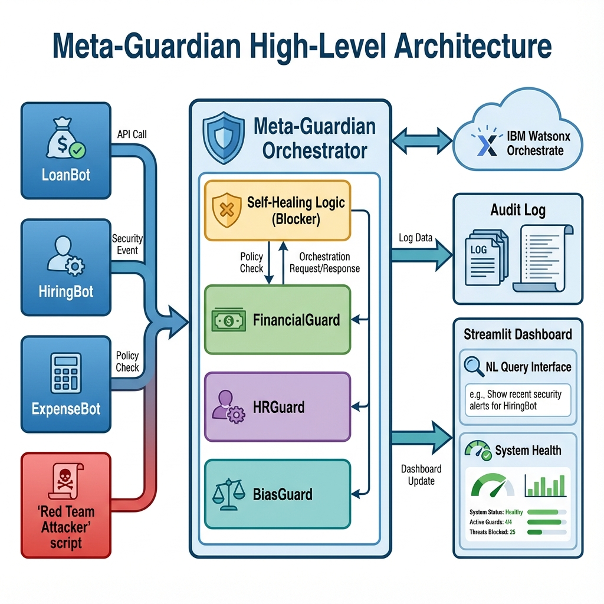

# 🛡️ AI Governance & Compliance Orchestrator (Meta-Guardian)

### *Addressing the meta-challenge of governing AI systems themselves*



## 🚨 The Problem
As enterprises deploy hundreds of AI agents, they face regulatory scrutiny (EU AI Act, NIST framework), bias risks, and coordination failures. Manual governance can't scale to meet the speed and volume of autonomous agent decisions.

## 💡 The Solution
**Meta-Guardian** is a meta-agent framework that orchestrates governance across your entire AI ecosystem. It acts as a "Chief Compliance Officer" for your AI workforce, ensuring every decision is monitored, audited, and compliant.

## ✨ Key Features
*   **🤖 Multi-Agent Orchestration**: Coordinates specialized governance agents (`FinancialGuard`, `HRGuard`, `BiasGuard`) alongside business agents.
*   **👁️ Real-Time Monitoring**: Monitors all agent interactions live via a Streamlit dashboard.
*   **📜 Automated Auditing**: Creates an immutable audit trail for every decision (SOX, GDPR, HIPAA ready).
*   **🛡️ Self-Healing System**: Automatically detects rogue agents (excessive violations) and **blocks** them from the network.
*   **💬 Natural Language Governance**: Executives can ask *"Show me high risk loans"* to get instant compliance insights.
*   **🔴 Red-Teaming Module**: Includes a built-in adversary script to continuously probe for vulnerabilities.
*   **☁️ IBM Watsonx Integration**: Securely authenticated with IBM Cloud IAM and ready for Watsonx Orchestrate deployment.

## 🛠️ Tech Stack
*   **Core**: Python 3.10+
*   **Orchestrator**: Flask (Simulating Watsonx Orchestrate Hub)
*   **Frontend**: Streamlit
*   **Cloud**: IBM Watsonx (IAM Auth, Orchestrate API)
*   **Data**: JSON (Simulating Cloudant/NoSQL)

## 🚀 Getting Started

### Prerequisites
*   Python 3.8 or higher
*   IBM Cloud Account (for API Key)

### Installation
1.  **Clone the repository**:
    ```bash
    git clone <repository-url>
    cd meta-guardian
    ```
2.  **Install dependencies**:
    ```bash
    pip install flask streamlit requests pandas fpdf
    ```
3.  **Configure Credentials**:
    Ensure `data.json` is present in the root directory with your IBM Watsonx credentials:
    ```json
    {
      "apikey": "YOUR_IBM_API_KEY",
      "url": "YOUR_ORCHESTRATE_URL"
    }
    ```

## 🎮 Usage Guide

### 1. Start the Orchestrator (Backend)
This service acts as the central hub, listening for agent webhooks and enforcing policies.
```bash
python orchestrator_simulator.py
```

### 2. Launch the Dashboard (Frontend)
Open the real-time monitoring interface in your browser.
```bash
python -m streamlit run dashboard/app.py
```

### 3. Generate Traffic (Mock Agents)
Simulate business agents making decisions (Loans, Hiring, Expenses).
```bash
python mock_agents/loan_bot.py
python mock_agents/hiring_bot.py
```

### 4. Run Red Team Attack (Security Demo)
Demonstrate the **Self-Healing** capability by launching a simulated attack.
```bash
python red_team_attack.py
```
*Result: The system will detect the attack and automatically BLOCK the malicious agent.*

## 🗺️ Future Roadmap

### Phase 1: Deep Watsonx Integration (Next 3 Months)
*   **Watsonx.ai LLM Guardrails**: Replace regex-based policy checks with `granite-13b-chat` for nuanced semantic analysis of complex policies.
*   **Cloudant Migration**: Move local JSON logging to IBM Cloudant for enterprise-grade scalability.

### Phase 2: Enterprise Scale (3-6 Months)
*   **Custom Policy Editor**: A UI for non-technical compliance officers to draft rules in natural language, compiled into Python logic by Watsonx.
*   **Slack/Teams Integration**: Real-time alerts sent directly to human compliance officers via Watsonx Orchestrate connectors.

### Phase 3: Autonomous Defense (6-12 Months)
*   **Adversarial Training**: Use the Red Team module to automatically retrain the BiasGuard model.
*   **Cross-Organization Governance**: Federation protocol to govern agents across different business units or partner organizations.

---
*Built for the Agentic-AI Hackathon with IBM Watsonx Orchestrate.*
